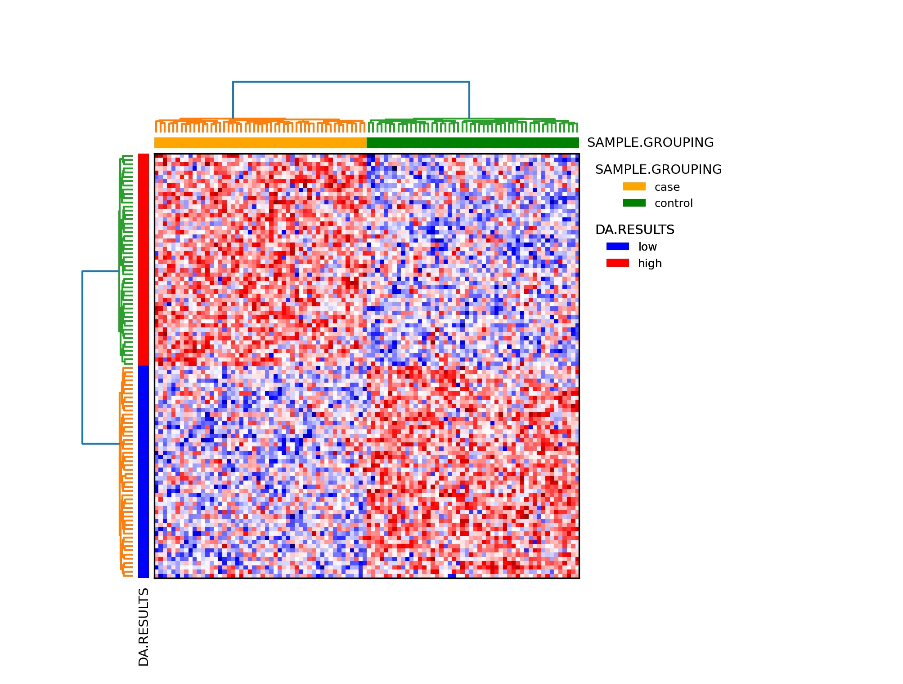
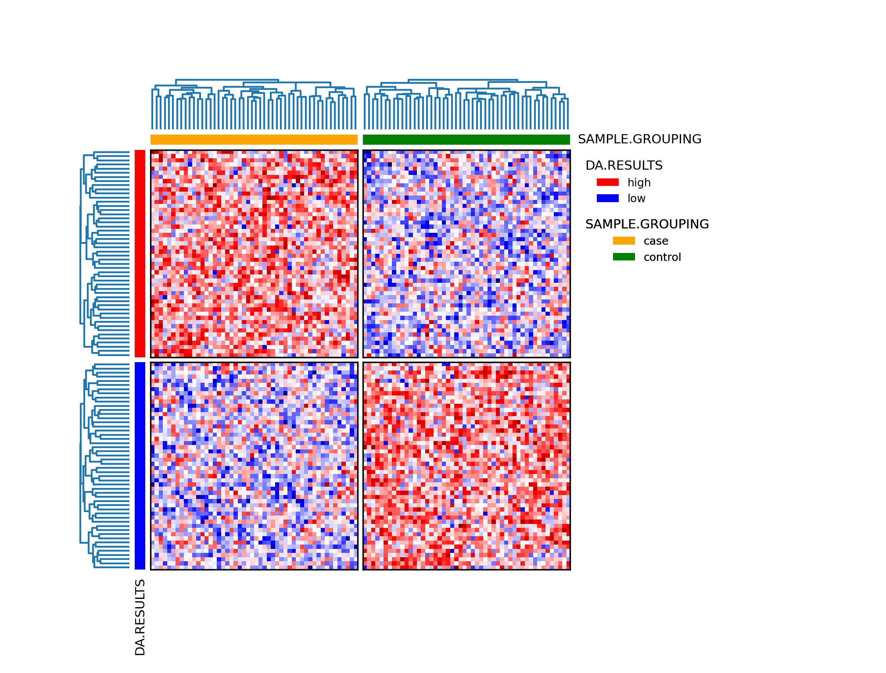
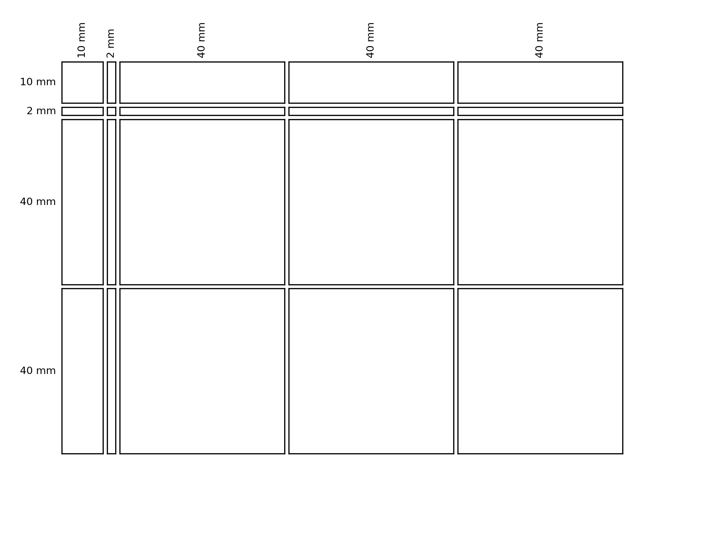

Introduction
============
This package implements a convenient heatmap plotting package in python. It offers low level functions for

1. Plotting
        - Heatmaps
        - Dendrograms
        - Annotations
        - Legends
2. Figure layouting

Clustered heatmap
-----------------

Grouped clustered heatmap
-------------------------

Figure layout
-------------

The hmap package comes with a module for defining the layout of a figure using absolute length measurements. Currently the only unit supported is milimeters. The layout of a figure is defined as a grid. You have to specify 

- the number of rows, 
- the number of columns, 
- the widths of the columns,
- the heights of the rows,
- the vertical distance between adjacent rows, 
- the horizontal distance between adjacent columns,
- the size of the bottom border margin,
- the size of the top border margin,
- the size of the left border margin, and
- the size of theright border margin

As said before, the sizes are given in milimeters.

    
The above plot shows a figure layout created with the hmap's layout subpackage.
